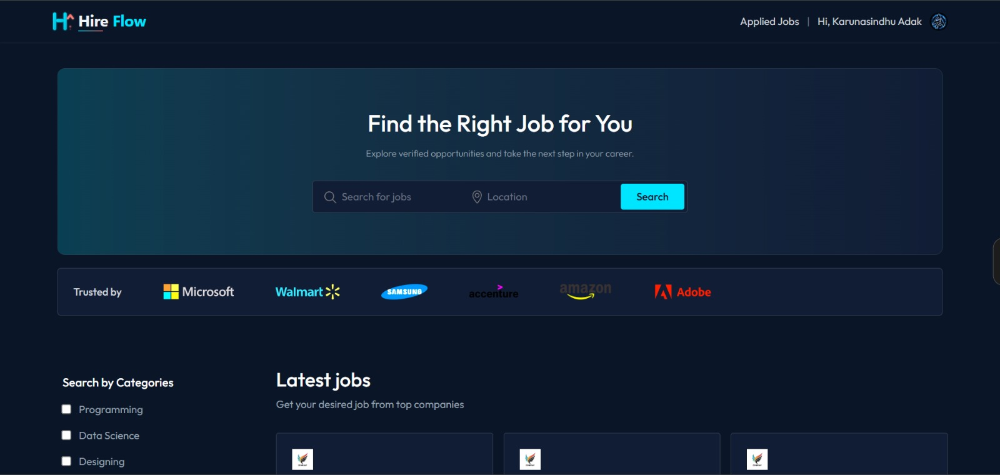
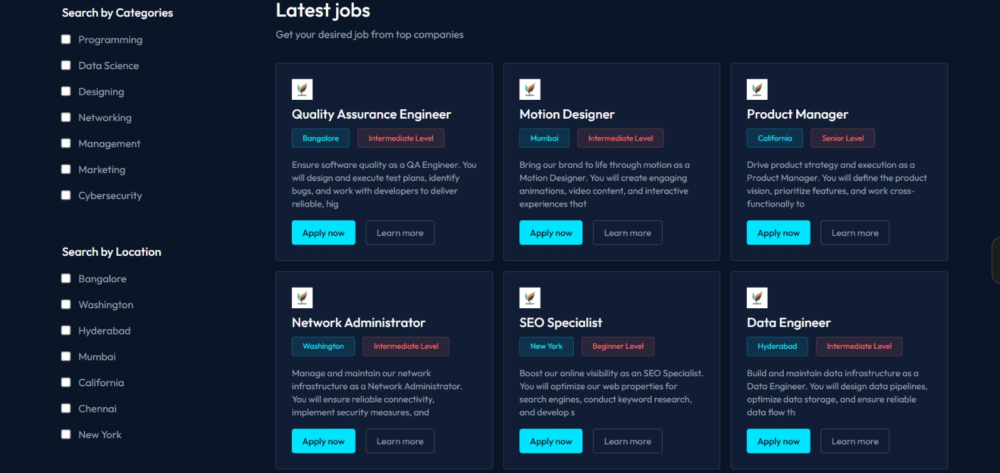
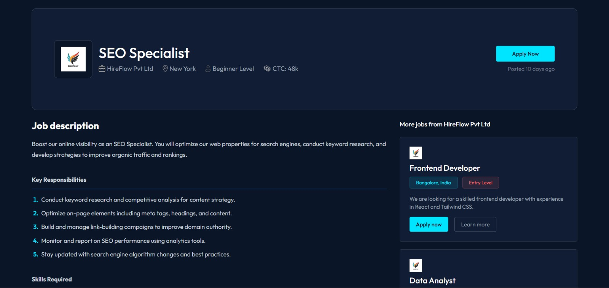
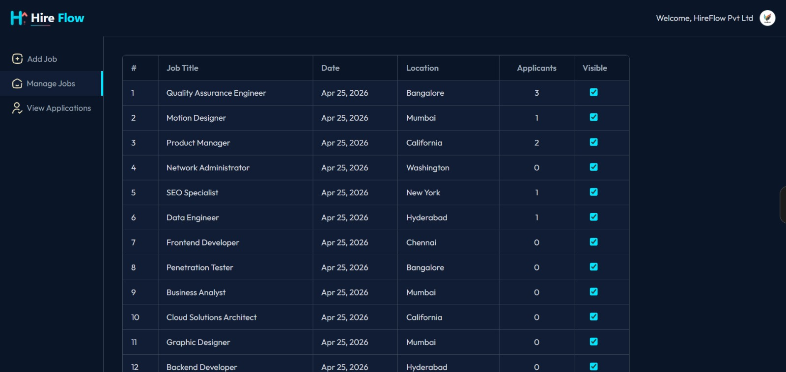

# HireFlow — Full Stack Job Portal

A modern, production-ready job portal built with the MERN stack. Candidates can discover, search, and apply for jobs. Recruiters can register their company, post positions, and manage applications — all through a sleek dark-themed interface.

🔗 **Live Demo:** [hireflow-silk.vercel.app](https://hireflow-silk.vercel.app)

---

## ✨ Features

### For Job Seekers

- 🔍 Search jobs by title, location, and category
- 📋 Browse job listings with smart filters (category, location, experience level)
- 📄 Apply to jobs with resume upload (PDF support via Cloudinary)
- 📊 Track application status (Pending / Accepted / Rejected)
- 🔐 Secure authentication via Clerk

### For Recruiters

- 🏢 Company registration with logo upload
- 📝 Post new jobs with rich-text descriptions (Quill editor)
- 📊 Dashboard to manage posted jobs and toggle visibility
- 👥 View and manage applicants per job
- ✅ Accept or reject applications

### Technical Highlights

- ⚡ Responsive dark-themed UI with glassmorphism accents
- 🔄 Real-time data sync between frontend and backend
- 🛡️ JWT-based authentication with access & refresh tokens
- 📡 RESTful API with MongoDB aggregation pipelines
- 🐛 Error monitoring with Sentry integration
- ☁️ Cloudinary for image and PDF uploads
- 🚀 Deployed on Vercel (frontend) + Render/Railway (backend)

---

## 🛠️ Tech Stack

| Layer       | Technology                                   |
| ----------- | -------------------------------------------- |
| Frontend    | React 18, Vite, TailwindCSS, React Router v6 |
| Backend     | Node.js, Express.js, MongoDB, Mongoose       |
| Auth        | Clerk (job seekers), JWT (recruiters)        |
| File Upload | Cloudinary, Multer                           |
| Monitoring  | Sentry                                       |
| Deployment  | Vercel (client), Render/Railway (server)     |

---

## 📸 Screenshots






---

## 🚀 Getting Started

### Prerequisites

- Node.js v18+
- MongoDB Atlas account
- Clerk account
- Cloudinary account

### Installation

```bash
# Clone the repo
git clone https://github.com/karunasindhuadak/hireflow-job-portal.git
cd hireflow-job-portal

# Install server dependencies
cd server
npm install

# Install client dependencies
cd ../client
npm install
```
